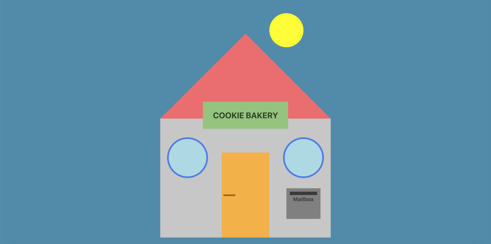

## Interactive Bakery House with React

Full Stack React web application displaying a bakery house with interactive features.
  
CLIENT 
React app made with Create-React-App: the frontend features the bakery house drawing built with HTML/JSX, CSS/SCSS, Bootstrap
  
SERVER 
Backend made with NPM, Node.js with Express, using PostgreSQL database
 

[**visit live app**](https://digital-bakery.herokuapp.com/)

## Implementation

- Focus on responsiveness and usability: the UI is fully responsive and cross-browser compatible. The features are animated with CSS and their functionality has been tested.

- I chose PostgreSQL, Node.js with Express for the database because I am not familiar with PHP - even if I am interested in learning it. I think that using PostgreSQL, Node.js with Express is a suitable alternative for the scope of this challenge and they integrate well in a React app.

- I've added React-Helmet for SEO metatags and deployed my implementation with Heroku: [visit live app](https://digital-bakery.herokuapp.com/)

## Testing

The components and main features have been all tested with Jest and React Testing Library.

## Future improvements

- add polyfills for older browsers
- improve accessibility

## Features

- on hover the windows transform to a cookie image
- a click on the door triggers POST request: a success message or error message indicates if the request was successful
- a click on the sun switches to night mode: transforming the windows and making a POST request are not possible anymore
- on click the mailbox falls to the ground

## Tech

**Stack**: SASS/SCSS, JavaScript, Node.js with Express, PostgreSQL, React, React Bootstrap,
React Testing Library, Jest  
**Deployment**: Heroku

## Visual

